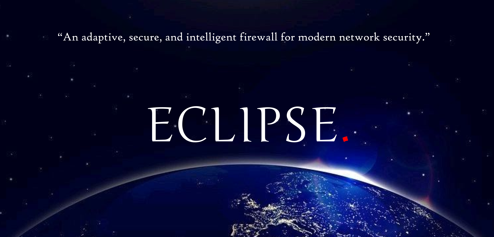

# Centralized Application-Context Aware Firewall



<!-- _An adaptive, secure, and intelligent firewall for modern network security._ -->

## Overview

Traditional firewalls rely on static, IP-based filtering, making them ineffective against modern threats like encrypted malware, VPN/proxy bypasses, and zero-day attacks. This **Centralized Application-Context Aware Firewall** enhances security by integrating **context-aware decision-making** with centralized control. It dynamically adapts to **application behavior, user roles, and network conditions**, ensuring granular security and real-time threat detection.

<!-- Give me icons for the specific headers -->

## 🛠 Features

- **Granular & Adaptive Policies** – Fine-tuned access control without over-restricting legitimate usage.
- **Context Awareness** – Dynamically adjusts firewall rules based on **user roles, applications, and network conditions**.
- **Real-Time Monitoring & Logging** – Detects and prevents abnormal network activity.
- **Secure Communication** – Uses **TLS encryption** and cryptographic signing for policy integrity.
- **Cross-Platform Support** – Works on **Windows & Linux**.
- **Scalability & Performance** – Lightweight design with **Go**, efficient policy enforcement, and low resource consumption.

## Architecture

### Core Components :

1. **End-point Agent**

   - Monitors application-level traffic.
   - Enforces policies locally (even offline).
   - Sends logs and alerts to the central server.

2. **Central Server**

   - Distributes signed, encrypted firewall policies over TCP.
   - Collects logs and maintains tamper-proof communication.

3. **Web Dashboard**
   - Provides real-time monitoring and **centralized policy management**.
   - Includes built-in fail-safe mechanisms.

### Communication :

- **TCP + Protocol Buffers** – Efficient firewall-backend communication.
- **REST API & WebSockets** – Enables backend-to-frontend communication and real-time updates.

## _Tech Stack_

| Component     | Technology                                   |
| ------------- | -------------------------------------------- |
| **Backend**   | Go (Firewall Agent, Policy Management)       |
| **Frontend**  | React (Web Dashboard)                        |
| **Database**  | SQLite (Firewall Rules, Logs, User Activity) |
| **Protocols** | TCP, REST API, WebSockets                    |

## Use Cases

- **Corporate Workplaces** – Enforce security policies for different applications.
- **Educational Institutions** – Prevent students from accessing unauthorized resources.
- **Coding Competitions** – Ensure fair play by restricting specific sites.

## Challenges & our Solutions

| Challenge             | Solution                                                              |
| --------------------- | --------------------------------------------------------------------- |
| **Agent Reliability** | Local policy caching ensures enforcement even when offline.           |
| **Security Risks**    | TLS encryption and cryptographic signing prevent unauthorized access. |
| **Scalability**       | Lightweight database & optimized indexing manage large-scale data.    |

## Installation

```bash
# Clone the repository
git clone /Link/
cd /Repo_name/

# Install dependencies
npm install  # For frontend

go mod tidy  # For backend

# Run the backend server
go run main.go

# Start the frontend
npm start
```

## References

- [Firewall Concepts](<https://en.wikipedia.org/wiki/Firewall_(computing)>)
- [Go Documentation](https://go.dev/doc/)
- [Protocol Buffers](https://protobuf.dev/overview/)
- [React Docs](https://react.dev/)

## 🤝 Contributing

We welcome contributions! Feel free to open an issue or submit a pull request.

## 📜 License

This project is licensed under the **MIT License**.

---

**Developed by Team Eclipse @ MITS Gwalior**
